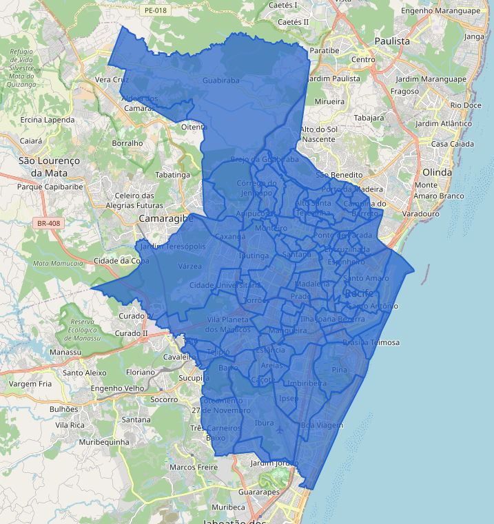

# Mapa Interativo de Recife



Este é um simples projeto de uma aplicação web interativa que utiliza a biblioteca Leaflet para exibir um mapa de Recife extraído do software QGIS através de um arquivo GeoJson, destacando os bairros da cidade. Além disso, a aplicação permite desenhar áreas no mapa e filtrar os bairros.

## Funcionalidades

- Visualização dos bairros de Recife no mapa.
- Busca por nome de bairro.
- Destaque e exibição de informações do maior e menor bairro.
- Ferramentas de desenho para adicionar polígonos no mapa.

## Requisitos

- Navegador web moderno (Google Chrome, Mozilla Firefox, etc.)
- Python (para rodar um servidor HTTP simples)

## Como Rodar Localmente

1. Clone este repositório:
    ```bash
    git clone https://github.com/seu-usuario/nome-do-repositorio.git
    ```

2. Navegue até o diretório do projeto:
    ```bash
    cd nome-do-repositorio
    ```

3. Inicie um servidor HTTP simples com Python:
    - Python 3.x:
      ```bash
      python -m http.server 8000
      ```
    - Python 2.x:
      ```bash
      python -m SimpleHTTPServer 8000
      ```

4. Abra o navegador e acesse:
    ```
    http://localhost:8000
    ```

## Estrutura do Projeto

- `index.html`: Arquivo principal que contém a lógica da aplicação e a estrutura HTML.
- `recifemapa.geojson`: Arquivo GeoJSON com os dados dos bairros de Recife.


## Licença

Este projeto é licenciado sob a [MIT License](LICENSE).

